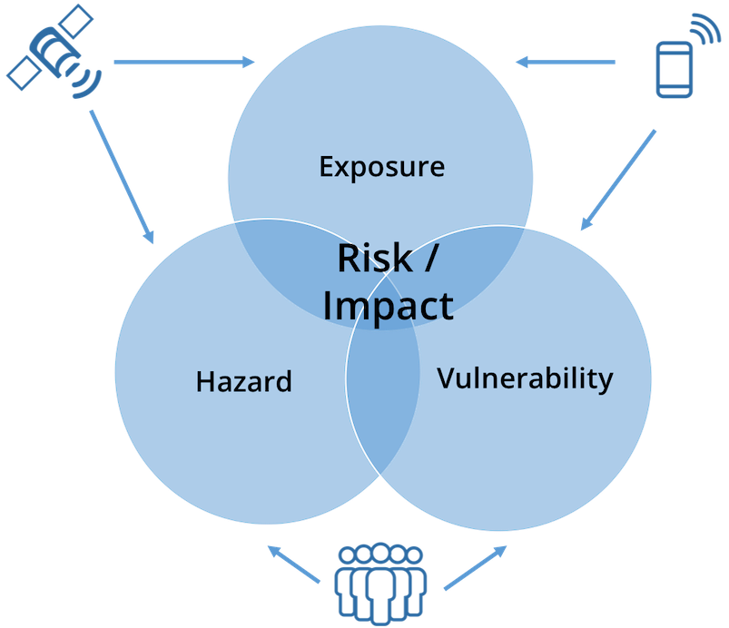

# Proyek

PRISM menilai potensi risiko dan memperkirakan dampak bahaya iklim pada komunitas yang paling rentan, untuk merancang kegiatan pengurangan risiko dan menargetkan respons bencana.

## Permasalahan

Translation results
Akses ke data dan informasi terbaru tentang bahaya iklim dan orang-orang yang rentan terhadapnya sangat penting bagi pengambil keputusan untuk mengurangi risiko. Namun, akses ke informasi ini merupakan tantangan karena keahlian dalam penginderaan jauh tidak tersebar luas dan data tentang kerentanan sulit diperoleh secara tepat waktu. Hal ini membuat pengambil keputusan memiliki informasi yang datang terlambat atau tidak menangkap seluruh analisis risiko.

## Solusi

PRISM enables WFP’s partners in government and WFP country offices to access the latest available climate hazard information alongside vulnerability data through an intuitive, map-based dashboard.  PRISM combines information from satellites and other remote sensing sources with WFP data on vulnerability to create actionable climate information for decision makers, allowing them to prioritize assistance to those most in need.

## siapa pengguna PRISM?

Tujuan PRISM adalah untuk memberdayakan pemerintah dengan kekayaan data dan informasi yang tersedia tentang risiko iklim. Platform ini menyediakan alat untuk memahami ke mana mengarahkan sumber daya untuk menjangkau populasi yang paling membutuhkan perlindungan dan bantuan. PRISM menyatukan otoritas manajemen bencana nasional, kantor meteorologi nasional, dan kementerian utama seperti pertanian, kesehatan, dan kesejahteraan sosial untuk secara kolektif memantau risiko, memprioritaskan tanggapan, dan menginformasikan program dan kebijakan.

Sistem ini secara aktif digunakan oleh mitra pemerintah di Indonesia, Sri Lanka, dan Kamboja, sementara penyebaran ke Mongolia dan Afghanistan akan segera dilakukan. Selain mitra pemerintah, WFP juga berbagi informasi dari PRISM dengan mitra kemanusiaan dan pembangunannya – menyediakan data dan informasi penting kepada khalayak luas. Saat proyek berlanjut, WFP juga berencana untuk memberikan informasi dari sistem kepada warga; menyediakan layanan iklim last mile secara langsung kepada masyarakat yang paling terkena dampak perubahan iklim.

## Informasi yang dihasilkan PRISM?

Keluaran utama PRISM adalah peta dan bagan interaktif, bersama dengan tabel dan laporan. Sistem ini dapat menghasilkan indikator pemantauan risiko iklim standar serta produk analisis risiko dan dampak, yang disesuaikan untuk setiap bahaya dan populasi yang berisiko terhadapnya.

Indikator bahaya – termasuk kekeringan dan banjir – dapat dipantau dari waktu ke waktu melalui peta yang intuitif dan interaktif. Bagan dan tabel terkait membantu mengukur tingkat bahaya menurut wilayah administratif (seperti provinsi dan kabupaten). Selain itu, sistem dapat secara otomatis menghasilkan indikator risiko dan dampak berdasarkan kerentanan yang diketahui dan paparan terhadap bahaya kapan saja. Semua informasi ini dapat diekspor dari sistem untuk analisis dan pelaporan lebih lanjut.

PRISM terintegrasi dengan platform pengumpulan data seluler – termasuk solusi open source seperti ODK dan Kobo Toolbox. Ini memungkinkan pengguna untuk memvisualisasikan data yang dikumpulkan dari area yang terkena dampak secara real-time, di samping informasi bahaya yang dihasilkan secara otomatis oleh platform.

## Bagaimana PRISM mengurangi risiko iklim?

PRISM mengisi kesenjangan informasi bagi para pengambil keputusan dengan menyajikan kepada mereka analisis risiko dan dampak hampir secara real-time. Di Kamboja dan Sri Lanka, misalnya, platform tersebut dipantau setiap hari di pusat operasi badan penanggulangan bencana nasional masing-masing negara. Selama masa berisiko tinggi (seperti musim hujan), WFP dan petugas manajemen bencana menggunakan PRISM untuk memberikan pembaruan rutin kepada pemangku kepentingan pemerintah dan mitra kemanusiaan dan pembangunan.

Saat ini, WFP menghubungkan PRISM dengan kegiatan pengurangan risiko sehingga analisis iklim menginformasikan program. Ini termasuk tautan ke Forecast-Based Financing (FBF), Early Warning / Early Action (EWEA) dan Shock Responsive Social Protection (SRSP). Sebagai platform analisis risiko dan sistem pemantauan, PRISM dapat mengukur risiko iklim dan, menggunakan ambang batas yang telah ditetapkan, secara otomatis memperingatkan manajer program tentang potensi bencana. Untuk EWEA, PRISM dapat bertindak sebagai pemicu untuk memulai program tindakan awal dengan menyediakan data kunci tentang area dan populasi yang berisiko. Dalam kasus SRSP, sistem dapat menyediakan data tentang jumlah penerima manfaat yang mungkin perlu dijangkau oleh program perlindungan sosial, baik sebagai strategi mitigasi maupun sebagai respons terhadap bencana.

Yang penting, analisis risiko yang berfokus pada populasi rentan memberdayakan otoritas manajemen bencana dengan informasi yang kemudian menjadi masukan bagi tanggapan pemerintah yang lebih luas di luar tanggapan mereka sendiri. Selain itu, sebagai platform yang menggabungkan informasi bahaya dengan kerentanan untuk menghitung risiko dan dampak, PRISM mampu menghasilkan prakiraan berbasis dampak: mengubah informasi iklim menjadi program yang berfokus pada dampak sosial ekonomi dari suatu bahaya.

## Hal yang masih perlu dilakukan

Komponen kunci untuk masa depan proyek ini adalah membangun kemitraan strategis. Ini termasuk terus membangun kemitraan dengan pemerintah, dan dengan komunitas ilmiah dan penelitian untuk lebih meningkatkan keandalan platform. Kemitraan sektor swasta baru sedang dijajaki untuk lebih meningkatkan teknologi, untuk mendapatkan akses ke data yang lebih dinamis yang dihasilkan melalui telepon seluler dan citra satelit resolusi tinggi.

WFP juga bekerja sama dengan mitra penelitian untuk meningkatkan risiko dan analisis dampak yang digunakan dalam sistem. Penelitian yang sedang berlangsung ini meneliti dampak historis dari bahaya iklim pada populasi yang rentan dari waktu ke waktu. Hasil penelitian ini akan menginformasikan analisis yang lebih ketat yang dihasilkan oleh PRISM.

Penelitian pengguna yang sedang berlangsung sangat penting untuk memahami bagaimana keputusan saat ini dibuat, dan bagaimana keputusan di masa depan dapat diinformasikan oleh data tentang risiko dan dampak. Melalui lokakarya desain, wawancara, dan konsultasi, WFP akan mengembangkan pemahaman yang lebih dalam tentang kebutuhan pengguna sistem. Hal ini pada gilirannya akan mengarah pada peningkatan desain sistem dan pengembangan fitur-fitur baru yang pada akhirnya akan membantu pemerintah melayani masyarakat rentan dengan lebih baik, menyelamatkan nyawa dan melindungi mata pencaharian.