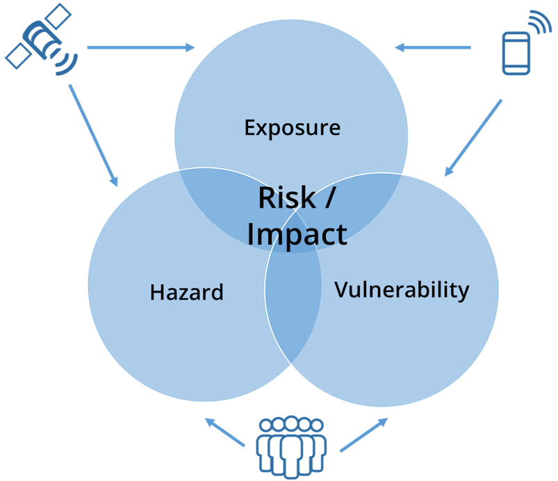

# Project

PRISM assesses the potential risk and forecasts the impact of climate hazards on the most vulnerable communities, in order to design risk reduction activities and target disaster responses.

## The Problem

Access to the latest data and information on climate hazards and the people vulnerable to them is critical for decision makers to mitigate risks. However, access to this information is challenging as expertise in remote sensing is not widespread and data on vulnerability is difficult to obtain in a timely manner. This leaves decision makers with information which either comes too late or does not capture the full breadth of a risk analysis.

## The Solution

PRISM enables WFP’s partners in government and WFP country offices to access the latest available climate hazard information alongside vulnerability data through an intuitive, map-based dashboard.  PRISM combines information from satellites and other remote sensing sources with WFP data on vulnerability to create actionable climate information for decision makers, allowing them to prioritize assistance to those most in need.

## Who uses PRISM?

The goal of PRISM is to empower governments with the wealth of data and information available on climate risk. The platform provides tools to understand where to direct resources to reach populations most in need of protection and assistance. PRISM brings together national disaster management authorities, national meteorological offices and key line ministries such as agriculture, health, and social welfare to collectively monitor risks, prioritize responses and inform programmes and policies.

The system is actively used by government partners in Indonesia, Sri Lanka, and Cambodia, while deployments to Mongolia and Afghanistan are forthcoming. Beyond government partners, WFP also shares information from PRISM with its humanitarian and development partners – providing key data and information to a wide audience. As the project continues, WFP also plans to provide information from the system to citizens; providing last mile climate services directly to the communities most impacted by climate change.

## What information does PRISM produce?

The primary outputs of PRISM are interactive maps and charts, along with tables and reports. The system can generate standard climate risk monitoring indicators as well as risk and impact analytical products, which are adapted for each hazard and the populations at risk to them.

The indicators on hazards – including droughts and floods – can be monitored over time through intuitive and interactive maps. Charts and related tables help to quantify the extent of a hazard by administrative area (such as provinces and districts). In addition, the system can automatically produce risk and impact indicators based on the known vulnerabilities and exposure to hazards at any point in time. All of this information can be exported from the system for further analysis and reporting.

PRISM integrates with mobile data collection platforms – including open source solutions such as ODK and Kobo Toolbox. This allows users to visualize data collected from impacted areas in real-time, alongside the hazard information automatically generated by the platform.

## How does PRISM mitigate climate risk?

PRISM fills information gaps for decision makers by presenting them with risk and impact analytics in near real-time. In Cambodia and Sri Lanka, for instance, the platform is monitored daily in the operations center of each country's national disaster management agency. During times of high risk (such as the monsoon season), WFP and disaster management officers use PRISM to provide regular updates to government stakeholders and humanitarian and development partners.

Currently, WFP is connecting PRISM to risk reduction activities so that climate analysis informs programming. This includes links to Forecast-Based Financing (FBF), Early Warning / Early Action (EWEA) and Shock Responsive Social Protection (SRSP). As a risk analytics platform and monitoring system, PRISM can measure climate risks and,using preset thresholds, automatically alert programme managers of a potential disaster. For EWEA, PRISM can act as a trigger to initiate early action programming by providing key data on areas and populations at risk. In the case of SRSP, the system can provide data on the number of beneficiaries that a social protection programme may need to reach, both as a mitigation strategy and as a response to a disaster.

Importantly, risk analytics focused on vulnerable populations empowers disaster management authorities with information that then feeds into broader government responses beyond their own. In addition, as a platform which combines hazard information with vulnerability to calculate risk and impact, PRISM is capable of producing impact-based forecasts: converting climate information into programming which focuses on the socioeconomic impact of a hazard.

## Where we go from here and what we still need

A key component for the future of the project is to establish strategic partnerships. This includes continuing to build partnerships with government, and with the scientific and research communities to further improve the reliability of the platform. New private sector partnerships are being explored to further improve the technology, to gain access to more dynamic data generated through mobile phones and high-resolution satellite imagery.

WFP also works alongside research partners to improve the risk and impact analysis used in the system. This ongoing research examines the historical impact of climate hazards on vulnerable populations over time. The outcome of this research will inform more rigorous analysis generated by PRISM.

Ongoing user research is critical to understanding how current decisions are made, and how future decisions can be informed by data on risk and impact. Through design workshops, interviews, and consultations, WFP will develop a deeper understanding of the user needs of the system. This will in turn lead to improved design of the system and the development of new features that will ultimately help governments better serve vulnerable communities, save lives and protect livelihoods.